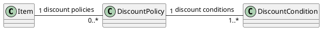

# 도메인이란?

소프트웨어를 구현할 때 모든 요구사항을 코드로 옮기는 건 현실적으로 불가능합니다.
따라서 어떤 요구사항을 코드로 구현하고 어떤 요구사항은 제외시킬지 정해야합니다.
정해진 요구사항의 범위를 **도메인**입니다.

소프트웨어 안에 포함시킬 요구사항의 범위를 정했다면 다음으로 요구사항들을 분석해야 합니다.
도메인안에 중요한 개념들을 이용해서 요구사항을 분석하고 이 개념들을 기반으로 시스템을 구현하는데 필요한 객체들을 식별할 수 있습니다.

예를 들어, 할인 정책으로 예를 들겠습니다. 무수한 할인 정책이 존재하겠지만, 현재 시스템에서는
금액 할인 정책(Amount Discount Policy), 비율 할인 정책(Percent Discount Policy)만 제한하겠습니다.
할인 정책 뿐만 아니라 할인 조건도 함께 고려해야 합니다.

이 때 어떠한 **도메인 item**과 할인 정책, 할인 조건은 관계로 표현됩니다.
도메인 개념들 사이에 연결 가능한 숫자의 범위를 다중성이라고 부르고 도메인 개념들을 연결한 선 아래의 숫자로 표기합니다.

## 절차적 설계

프로그램을 데이터와 이 데이터를 사용하는 알고리즘 또는 프로세스의 조합으로 정의합니다.
절차적인 방식은 프로그램을 구성하는 데이터와 프로세스를 개별적인 모듈로 분류해서 구현하는 방식을 의미합니다.

데이터와 프로세스를 분류해서 구현하려면 데이터를 먼저 구현할지 아니면 프로세스를 먼저 구현할지 순서를 정해햐합니다.
데이터를 먼저 정의한다면, 데이터베이스를 설계하고 데이터를 사용하는 프로세스를 나중에 정의합니다.
테이블 사이의 관계를 이용해서 데이터의 구조를 설계합니다.

