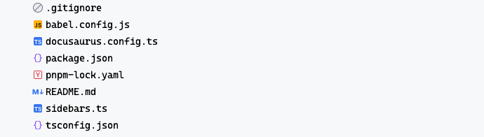
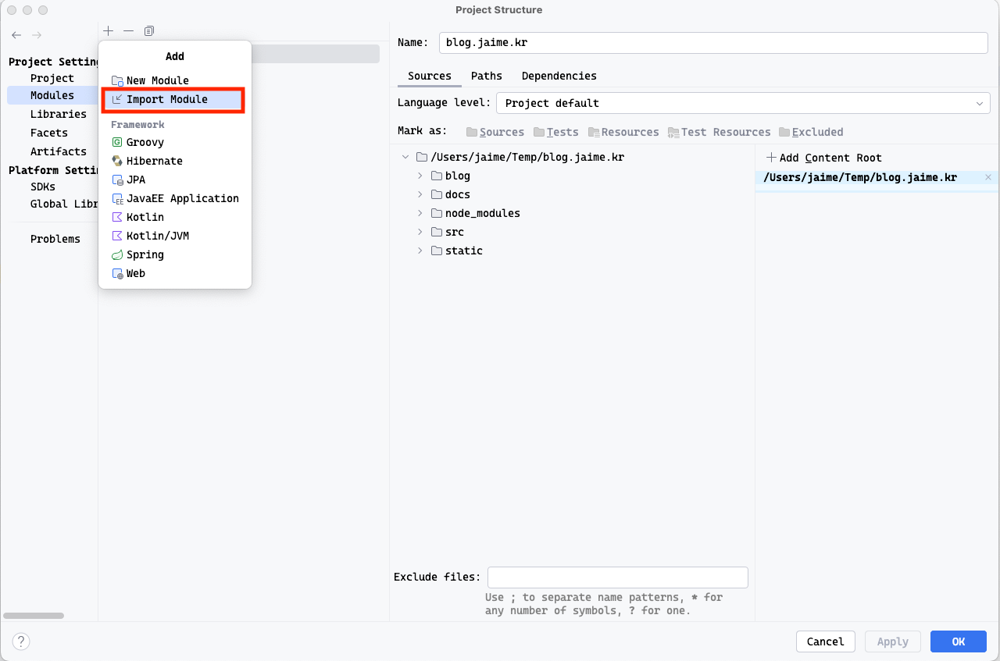
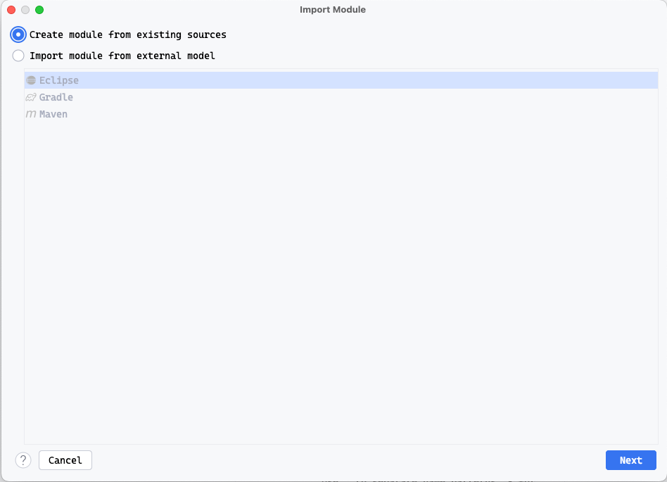

## 상황

간혹 인텔리제이로 프로젝트를 열 때, 프로젝트가 보이지 않는 경우가 있습니다.

## 해결 방법

1. import module
   - 경로 1: `File` - `Project Structure` - `Modules` 
   - 경로 2: `command + ;` - Modules
   - 

   - 진행중이던 프로젝트를 선택합니다.

2. create module

