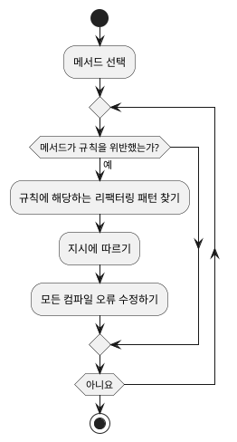

# [Five Lines Of Code] 1. 리팩터링 리팩터링하기

- "좋은 코드"는 사람이 읽기 쉽고, 유지보수가 용이하며, 의도한 대로 잘 동작하는 코드입니다.
- "리팩터링"은 기능을 변경하지 않고 코드의 가독성과 유지보수가 쉽도록 코드를 변경하는 것입니다.

1. **탐색**: 기획 혹은 고객이 무엇을 필요로 하는지 확인하는 과정입니다. 기술적으로 구현이 가능한지 확인하며 기획이나 FE에게 반문을 하여 좀 더 구체화합니다.
2. **명세화**: 무엇을 만들지 알게 되면 그것을 명세화합니다. 최적의 경우, 이것은 자동화된 테스트의 형태가 됩니다.
3. **구현**: 코드를 구현합니다.
4. **테스트**: 2단계의 명세(사양)을 따르는지 확인합니다.
5. **리팩터링**: 코드를 전달하기 전에 다음 사람이 쉽게 작업할 수 있는지 확인합니다. (다른 사람이 미래의 본인 자신이 될 수 있다.)
6. **전달**: PR 혹은 MR 을 통해 다른 팀원에게 전달합니다.

다음은 **리팩터링**을 확대한 것입니다.

