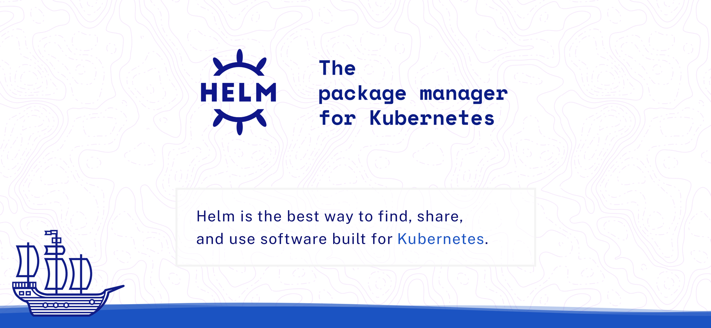
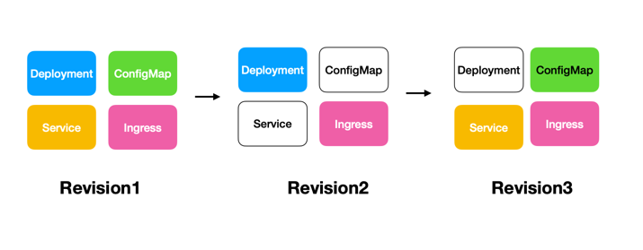

# Helm Kubernetes Packaging Manager for Developers and DevOps

## Helm 이란?



<center>_출처: https://helm.sh_</center> <br/>

Helm은 [CNCF Graduated Project](https://www.cncf.io/projects/)로 **쿠버네티스 패키지 관리자**입니다. 흔히 알고 있는 패키지 관리자로는 apt, yum, brew 등이 있습니다. 위 패키지 관리자는 install, upgrade, uninstall 등의 기능을 제공합니다. 즉, helm 또한 어떠한 리포지토리에 존재하는 관리되고 있는 리소스를 가져다 쓸 수 있습니다.

이 때 관리되는 자원을 **Chart**라고 하며, Chart는 **Kubernetes 리소스를 설명하는 파일들의 집합**입니다. Chart는 **템플릿화된 쿠버네티스 리소스를 포함**하고 있습니다. 이를 통해 **동일한 구성을 가진 여러 개의 리소스를 생성**할 수 있습니다.



```bash title="helm 간단한 예시"
$ helm install apache bitnami/apache -n web
$ helm upgrade apache bitnami/apache -n web
$ helm rollback apache 1 -n web
$ helm uninstall apache
```

<br/><br/>  

## Helm in action

### Chart Repository

- https://bitnami.com/stacks
- https://github.com/bitnami/charts/tree/main/bitnami

### Chart Repository 추가

```bash title="chart repository 추가"
$ helm repo list
$ helm repo add bitnami https://charts.bitnami.com/bitnami
$ helm repo remove bitnami

$ helm search repo mysql
$ helm search repo database
$ helm search repo database --versions
```

```shell
$ helm install mydb bitnami/mysql
NAME: mydb
LAST DEPLOYED: Sat May 18 23:28:48 2024
NAMESPACE: default
STATUS: deployed
REVISION: 1
TEST SUITE: None
NOTES:
CHART NAME: mysql
CHART VERSION: 10.2.4
APP VERSION: 8.0.37

** Please be patient while the chart is being deployed **

Tip:

  Watch the deployment status using the command: kubectl get pods -w --namespace default

Services:

  echo Primary: mydb-mysql.default.svc.cluster.local:3306

Execute the following to get the administrator credentials:

  echo Username: root
  MYSQL_ROOT_PASSWORD=$(kubectl get secret --namespace default mydb-mysql -o jsonpath="{.data.mysql-root-password}" | base64 -d)

To connect to your database:

  1. Run a pod that you can use as a client:

      kubectl run mydb-mysql-client --rm --tty -i --restart='Never' --image  docker.io/bitnami/mysql:8.0.37-debian-12-r2 --namespace default --env MYSQL_ROOT_PASSWORD=$MYSQL_ROOT_PASSWORD --command -- bash

  2. To connect to primary service (read/write):

      mysql -h mydb-mysql.default.svc.cluster.local -uroot -p"$MYSQL_ROOT_PASSWORD"

WARNING: There are "resources" sections in the chart not set. Using "resourcesPreset" is not recommended for production. For production installations, please set the following values according to your workload needs:
  - primary.resources
  - secondary.resources
+info https://kubernetes.io/docs/concepts/configuration/manage-resources-containers/

# Get the MySQL Helm Info
$ helm status mydb
```

```shell title="helm deploy with namespace"
$ helm install mydb bitnami/mysql --namespace dev
$ helm list -n dev
$ helm uninstall mydb -n dev
```


```yaml title="values.yaml"
# Default values for mysql
auth:
  rootPassword: test1234
```

```shell title="helm install mysql with values.yaml"
$ helm install mydb bitnami/mysql --namespace dev --values ./values.yaml
$ helm install mydb bitnami/mysql --namespace dev --set auth.rootPassword=test1234
```

### Helm upgrade

```shell
$ helm repo update
$ helm upgrade mydb bitnami/mysql --namespace dev --values ./values.yaml
$ helm upgrade mydb bitnami/mysql --namespace dev --set auth.rootPassword=test1234
$ helm upgrade mydb bitnami/mysql -n dev --reuse-values # 값을 유지 
```

## Advanced Commands

```shell title="helm dry-run"
$ helm install mydb bitnami/mysql --namespace dev --values ./values.yaml --dry-run
$ helm template mydb bitnami/mysql --namespace dev --values ./values.yaml
```
